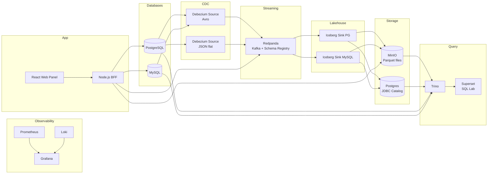
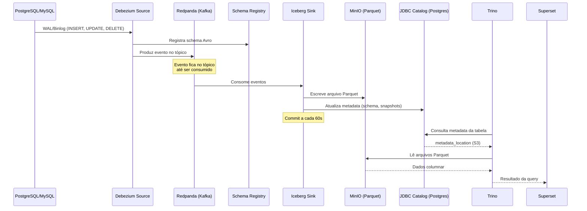
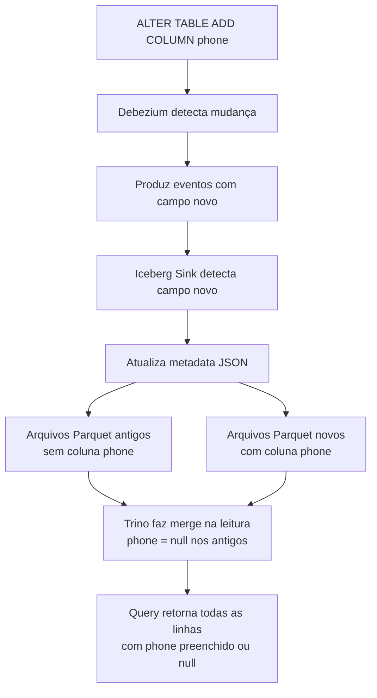

# CDC Platform


Projeto de captura de dados (CDC) em bancos PostgreSQL e MySQL via Debezium, transmitindo dados em streaming via Redpanda, materialização em tabelas Iceberg no MinIO e consumo federado via Trino e Superset.

## Arquitetura

### Visão geral



### Pipeline CDC detalhado



### Schema Evolution (Iceberg)



## Stack

| Componente | Tecnologia | Porta | Descrição |
|---|---|---|---|
| **Databases** | PostgreSQL 16, MySQL 8 | 5432, 3307 | Bancos de origem do CDC |
| **CDC** | Debezium 2.5 (Kafka Connect) | 8083 | Captura mudanças via WAL/binlog |
| **Streaming** | Redpanda | 9092, 8081 | Broker Kafka + Schema Registry |
| **Lakehouse** | Apache Iceberg + Parquet | — | Tabelas com schema evolution |
| **Storage** | MinIO | 19000, 19001 | Object storage S3-compatible |
| **Catalog** | JDBC Catalog (Postgres) | 5432 | Metadata das tabelas Iceberg |
| **Query Engine** | Trino | 8085 | SQL federado sobre todas as fontes |
| **BI** | Apache Superset | 8088 | SQL Lab + dashboards |
| **Backend** | Node.js + Fastify | 3001 | BFF do painel web |
| **Frontend** | React + Vite | 5173 | Painel de gerenciamento CDC |
| **Monitoring** | Prometheus + Grafana + Loki | 9090, 3000, 3100 | Métricas, dashboards, logs |

## Quick Start

### Pré-requisitos

- Docker e Docker Compose
- Make (pré-instalado no macOS e na maioria das distros Linux)

### 1. Subir a plataforma

```bash
make up
```

Isso inicia todos os containers, aguarda o Kafka Connect ficar healthy e registra os connectors CDC automaticamente.

### 2. Inserir dados de teste

```bash
# Inserir em todas as tabelas (Postgres + MySQL)
make fake-all ROWS=10

# Ou individualmente
make fake-pg-customers ROWS=20
make fake-pg-products ROWS=10
make fake-pg-orders ROWS=15
make fake-mysql-employees ROWS=20
make fake-mysql-departments ROWS=5
make fake-mysql-audit ROWS=10
```

| Variável | Default | Descrição |
|---|---|---|
| `ROWS` | 10 | Quantidade de linhas por tabela |
| `INTERVAL` | 0.5 | Segundos entre cada insert (útil para observar CDC em tempo real) |

### 4. Verificar status

```bash
make status
```

Mostra o estado dos containers e dos connectors CDC.

### 5. Parar a plataforma

```bash
make down
```

### Comandos disponíveis

```bash
make help
```

```
  up                        Sobe toda a plataforma e registra os connectors
  down                      Para toda a plataforma
  restart                   Reinicia toda a plataforma
  logs                      Mostra logs dos containers (use SERVICE=nome para filtrar)
  status                    Mostra status dos containers e connectors
  connectors                Registra/re-registra os connectors CDC
  fake-pg-customers         Insere customers fake no Postgres (ROWS=10 INTERVAL=0.5)
  fake-pg-products          Insere products fake no Postgres
  fake-pg-orders            Insere orders fake no Postgres
  fake-mysql-employees      Insere employees fake no MySQL
  fake-mysql-departments    Insere departments fake no MySQL
  fake-mysql-audit          Insere audit_log fake no MySQL
  fake-all                  Insere dados em todas as tabelas (Postgres + MySQL)
```

## URLs e Credenciais

| Serviço | URL | Credenciais |
|---|---|---|
| **Web Panel** | http://localhost:5173 | — |
| **Superset** (SQL Lab) | http://localhost:8088 | admin / admin |
| **Grafana** | http://localhost:3000 | admin / admin |
| **Redpanda Console** | http://localhost:8080 | — |
| **MinIO Console** | http://localhost:19001 | minioadmin / minioadmin |
| **Trino UI** | http://localhost:8085 | — (read-only) |
| **Kafka Connect** | http://localhost:8083 | — |
| **BFF API** | http://localhost:3001/api | — |
| **Prometheus** | http://localhost:9090 | — |

## Connectors

### Sources

| Connector | Formato | Descrição |
|---|---|---|
| `postgres-source-iceberg` | JSON flat | CDC do PostgreSQL para tópicos `pg-iceberg.public.*` |
| `mysql-source` | Avro | CDC do MySQL para tópicos `mysql.cdc_source.*` |

### Sinks (Iceberg)

Um sink individual por tabela, criado automaticamente pela aba Sinks do painel:

| Connector | Tópico | Tabela Iceberg |
|---|---|---|
| `iceberg-sink-pg-customers` | `pg-iceberg.public.customers` | `bronze.pg_customers` |
| `iceberg-sink-pg-orders` | `pg-iceberg.public.orders` | `bronze.pg_orders` |
| `iceberg-sink-pg-products` | `pg-iceberg.public.products` | `bronze.pg_products` |
| `iceberg-sink-mysql-employees` | `mysql.cdc_source.employees` | `bronze.mysql_employees` |
| `iceberg-sink-mysql-departments` | `mysql.cdc_source.departments` | `bronze.mysql_departments` |
| `iceberg-sink-mysql-audit_log` | `mysql.cdc_source.audit_log` | `bronze.mysql_audit_log` |

Cada sink é isolado — falha em uma tabela não afeta as demais.

## Lakehouse (Iceberg)

### Tabelas

As tabelas Iceberg são criadas automaticamente pelo sink connector e ficam acessíveis via Trino:

```sql
-- Listar tabelas
SHOW TABLES FROM iceberg.bronze;

-- Consultar dados do CDC
SELECT * FROM iceberg.bronze.pg_customers;
SELECT * FROM iceberg.bronze.pg_orders;
SELECT * FROM iceberg.bronze.pg_products;
```

### Consultas federadas (via Trino)

O Trino conecta em todas as fontes com uma única conexão:

```sql
-- Direto no PostgreSQL
SELECT * FROM postgres.public.customers;

-- Direto no MySQL
SELECT * FROM mysql.cdc_source.employees;

-- JOIN entre bancos diferentes
SELECT c.name AS customer, e.department
FROM postgres.public.customers c
JOIN mysql.cdc_source.employees e ON c.id = e.id;

-- Dados do lakehouse — Bronze (histórico completo)
SELECT * FROM iceberg.bronze.pg_customers;

-- Dados do lakehouse — Silver (estado atual, sem deletados)
SELECT * FROM iceberg.silver.pg_customers;
```

### Catalogs disponíveis no Trino

| Catalog | Fonte | Tipo |
|---|---|---|
| `postgres` | PostgreSQL (tempo real) | JDBC |
| `mysql` | MySQL (tempo real) | JDBC |
| `iceberg` | MinIO via JDBC Catalog | Iceberg (Parquet) |

### Schemas do Iceberg

| Schema | Conteúdo |
|---|---|
| `iceberg.bronze` | **Bronze** — todos os eventos CDC (append-only, inclui deletados com `__deleted=true`) |
| `iceberg.silver` | **Silver** — estado atual (deduplicado por PK, sem deletados) |

As views Silver são geradas automaticamente ao triggar snapshot incremental (↻) ou via `POST /api/lakehouse/silver/generate-all`. A PK de cada tabela é definida pelo usuario ao criar o sink no painel.

### Schema Evolution

Com `iceberg.tables.evolve-schema-enabled=true`, quando uma coluna é adicionada ou alterada no banco de origem:

1. O Debezium detecta a mudança e produz eventos com o novo schema
2. O Iceberg Sink atualiza o metadata da tabela automaticamente
3. Arquivos Parquet antigos coexistem com novos — o Trino faz merge na leitura
4. Nenhum reprocessamento é necessário

### Armazenamento no MinIO

```
warehouse/                          ← bucket Iceberg
└── bronze/
    ├── pg_customers/
    │   ├── data/
    │   │   ├── 00001-....parquet   ← dados columnar
    │   │   └── ...
    │   └── metadata/
    │       ├── 00000-....json      ← snapshot inicial
    │       ├── 00001-....json      ← snapshot após commit
    │       └── ...
    ├── pg_orders/
    └── pg_products/

```

## Bancos de Dados

### PostgreSQL (cdc_source)

| Tabela | Colunas |
|---|---|
| `customers` | id, name, email, created_at, updated_at |
| `orders` | id, customer_id, total, status, created_at |
| `products` | id, name, price, stock, category |

Conexão direta: `localhost:5432` / `postgres` / `postgres`

### MySQL (cdc_source)

| Tabela | Colunas |
|---|---|
| `employees` | id, name, department, salary, hired_at |
| `departments` | id, name, budget, location |
| `audit_log` | id, entity, action, payload, timestamp |

Conexão direta: `localhost:3307` / `root` / `root`

## Painel Web

O painel web (React) oferece:

- **Dashboard** — KPIs dos connectors (running, paused, failed) e health dos serviços
- **Sources** — gerenciamento dos source connectors (Debezium), com wizard para criar novos sources
- **Sinks** — gerenciamento dos sinks Iceberg por tabela, com ações de snapshot incremental, pausar/retomar/remover e criação de novos sinks vinculados a sources
- **Observability** — dashboards Grafana embeddados e health check

O design usa tema escuro, CSS custom properties e tipografia Geist.

## Observability

- **Prometheus** (`:9090`) — coleta métricas do Kafka Connect e serviços
- **Grafana** (`:3000`) — dashboards de CDC Pipeline, Infrastructure e Logs Explorer
- **Loki + Promtail** — agregação de logs dos containers

## Desenvolvimento local

Para desenvolvimento com hot reload, é necessário Node.js 20+:

```bash
# BFF (hot reload)
cd apps/bff && npm run dev

# Web (hot reload)
cd apps/web && npm run dev

# Testes do BFF
cd apps/bff && npm test
```

## Portas

| Serviço | Porta Host | Porta Container | Nota |
|---|---|---|---|
| PostgreSQL | 5432 | 5432 | |
| MySQL | 3307 | 3306 | Remapeada para evitar conflito |
| Redpanda (Kafka) | 9092 | 9092 | |
| Schema Registry | 8081 | 18081 | Via Redpanda |
| Redpanda Console | 8080 | 8080 | |
| Kafka Connect | 8083 | 8083 | |
| MinIO API | 19000 | 9000 | Remapeada |
| MinIO Console | 19001 | 9001 | Remapeada |
| Trino | 8085 | 8085 | |
| Superset | 8088 | 8088 | |
| Grafana | 3000 | 3000 | |
| Prometheus | 9090 | 9090 | |
| Loki | 3100 | 3100 | |
| BFF | 3001 | 3001 | |
| Web Panel | 5173 | 5173 | |
